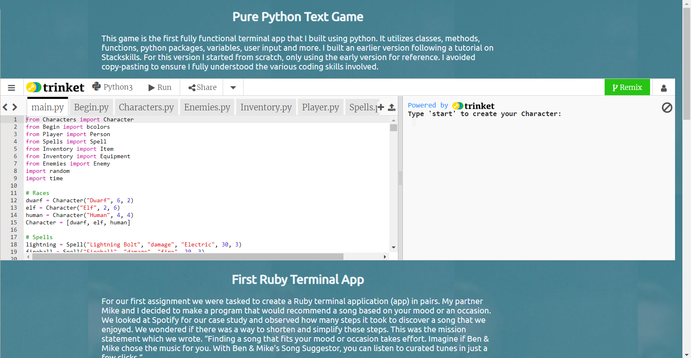

# My Portfolio Website

[This is the published version of my website](https://becrusty.github.io "Benjamin Crow")

[This is the link to the full github repository](https://github.com/BeCrusty/my_portfolio "My_Portfolio")

[This repo is where the site is hosted from and only contains src files](https://github.com/BeCrusty/becrusty.github.io)

## Description

### Purpose
This website is intended to present me as a potential employee, essentially acting as a digital resume. With that in mind I have included key information on my education, work history, soft and hard skills. Incorporated into all of this is information and design that communicate my personality and culture as an employee.

---

### Features
The website incorporates a range of features that emphasise my *design capabilities* and *functional skills*.
Key design features include:
  * A fixed viewport image that frames content and works responsively across different screen sizes.
  * A consistent colour scheme across the site that prioritises two complementary colours with some lighter colours for visibility.
  * Careful positioning of key elements, e.g. menu button, to ensure visibility.
  * Consistent font selection, with one font for headers and one for text content right through the main page.
  * Flexbox is used to change up the layout of my educational info.
  * A table is used to layout my work history in a visual, readable format.

Key functionality:
  * A fixed sidebar links to social media sites, github etc. using the distinctive icons/buttons.
  * The top left of the sidebar has a menu icon that holds a dropdown list linking to key parts of the main page.
  * At the bottom of the sidebar is an email icon that links to a separate contact me page.
  * The footer displays a series of icons showing languages I have worked in and a link to a separate page showing previous projects.
  * The projects page contains an interactive python console with a prebuilt text game.
  * The contacts page has a functional contact me form.

---

### Sitemap
#### XML version
Below is a url based sitemap and a visual representation of the connection between the pages.
```
<url>
  <loc>https://becrusty.github.io/</loc>
  <lastmod>2019-03-24T00:49:38+00:00</lastmod>
  <priority>1.00</priority>
</url>
<url>
  <loc>https://becrusty.github.io/contact.html</loc>
  <lastmod>2019-03-24T00:49:38+00:00</lastmod>
  <priority>0.80</priority>
</url>
<url>
  <loc>https://becrusty.github.io/projects.html</loc>
  <lastmod>2019-03-24T00:49:38+00:00</lastmod>
  <priority>0.80</priority>
</url>
<url>
  <loc>https://becrusty.github.io/index.html</loc>
  <lastmod>2019-03-24T00:49:38+00:00</lastmod>
  <priority>0.64</priority>
</url>
</urlset>
```
#### Visual Sitemap: 


---

### Screenshots
Below are three screenshots of the current website version. The first is of the main page at index.html, the second is of the contact me page at contact.html and the final shot shows part of the projects page at projects.html.

Home page: 


Contact Me page: 


Projects page: 


### Target Audience
With my current level of experience the target audience is potential employers from different sized businesses. This informed what content was prioritized and what information was provided. With sufficient experience to freelance, that target audience would shift slightly to include more of the general public.

---

### Tech Stack
The design process for this portfolio utilised canva's colour palette generator and Balsamiq 3's mockup software.
The actual layout and design relies heavily on **html 5** and **css 3**, although the functionality of css was extended through the SASS framework. A small amount of PHP is used for basic form handling and finally, the projects page contains an interactive shell that demonstrates some of my previous work with Python.
The website itself is hosted through GitHub's free hosting service. It hosts directly from a conventionally named repository, "username.github.io", by executing the index.html file contained within the root folder of that repository.

---

## Design Documentation

### Design Process
The first stage of my design process was to browse through other Web Developer portfolio sites. This allowed me to identify the portfolio features I found effective and to ensure I avoided those I found ineffective. This allowed me develop some really basic hand-drawn wireframes, seen below. I further developed these ideas through Pinterest by pinning ranging from portfolio screenshots to interior design images.
From these images I developed a basic mood board: [Portfolio Mood Board](https://www.pinterest.com.au/bennycrow91/portfolio/). I then used [Canva](https://www.canva.com/colors/color-palette-generator/) to generate a colour palette from an image I felt contained the mood I wanted to convey through my portfolio website. The first palette was taken from [Legwork Studio](http://www.legworkstudio.com/home). Particularly these colours: 
. 
However, during the early stages of wireframing the colour palette seemed too basic without the animations featured on that website. My final colour palette was thus taken primarily from this image:

I particularly like the contrasting senses of warmth and structure the colours in this image convey.

With my final wireframing completed through balsamiq I wrote out the core html layout, using filler for content. I then proceeded to work on my main.scss file, compiling in stages, to style the body of index.html until I had roughly matched my final wireframe. Again,the layout did not meet my expectations so I chose to relocate the sidebar and remove the secondary fixed bar altogether in favour of a dropdown menu. One additional step I took was to incorporate a background image that frames the content. The inspiration from this was also taken from the above image, where each terrarium is distinctly framed to manage the viewer's focus. The contact and projects pages seek to maintain core elements of these themes and inspirations while adding content that connects the viewer more with me personally, e.g. the photo background used on the contacts page.

---

### Wireframes
Wireframing was achieved in two stages. Firstly through basic drawing, emphasising mobile-first design:

Secondly, through a low-fi mockup on Balsamiq:


### Usability
The website docs all specify lang="en" inside the html property to ensure screen readers can identify the appropriate language for each page. All images used on the website have some alt text to ensure those with visual impairment will better be able to understand what content the website holds. The colour palette for key areas is sufficiently contrasting but there a still a number of elements where the colour palette needs to be adjusted to maximise contrast for visual accessibility. There are a few other issues with the current accessibility. In particular, the dropdown menu and the table containing my work history do not yet meet accessibility guidelines that would ensure a screen reader could correctly convey the content and function of each element. That is a priority for future development of the website.

---

## Planning Process

### Project Plan
I created a broad project timeline at the beginning of the project. a screenshot of it can be seen below:

As the project progressed it became clear that I had not accounted for the complexity of the design process. As such, the first two stages stretched well into the fourth day. This meant that a number of the features, particularly around accessibility, were not able to be incorporated within the project timeline.

To avoid missing the deadline I utilised Trello throughout the project to keep track of which tasks needed to be prioritised and to remember what stage each aspect of the project was at during the previous day. Two screenshots of the board at different stages are provided below.
 

<!--
Short Answer Q&A - Include short answers to the following questions,
Describe key events in the development of the internet from the 1980s to today (max. 150 words)
Define and describes the relationship between fundamental aspects of the internet such as: domains, web servers, DNS, and web browsers (max. 150 words)
Reflect on one aspect of the development of internet technologies and how it has contributed to the world today (max. 150 words) -->

## Short Answer Q & A

### Key events in the development of the internet from the 1980's to today
The 1980's saw computer communication already present through MODEM and protocols like TCP/IP. Paul Allen and Bill Gates are working to create DOS, the foundation for much of today's computer operating systems, alongside Apple’s OS. Communications between these systems were standardized through protocol like SMTP(1983). As the number of computers used in the US grows to over 45 million 'hypertext' is first proposed. The modern internet and the World Wide Web is launched a year later in 1991. A few years later Tim-Berners Lee founds the WWW Consortium to help standardize formatting etc. This is complemented by the IETF who are responsible for standardizing the various communication protocols. By the time we reach 2002 approximately 1 billion PC’s have been sold and Google, Amazon, PayPal and EBay have all been established. These corporations begin building many of the datacentres that are key to the volume of information available through the cable ‘backbone’ of the internet.

### Define and describe the relationship between fundamental aspects of the internet.
The internet is fundamentally a series of computers, ranging from pc’s to datacentres, that are connected across and between continents by cable. These connections are managed by specific network protocol that allow for rapid data transmission. Each individual computer, or set of computers, on this network is known as a domain. These domains are ‘named’ using the Domain Naming System and communicate by following the TCP/IP protocol. DNS functions as a way for of interpreting domain names into a real IP address to facilitate connections with targeted servers like Google’s data centre. These ‘web servers’ are essentially computers that are connected to the internet and support physical data exchange, primarily through HTTP software. This data is typically represented inside an HTML document. These documents are largely laid out and made human readable by web browsers that have the necessary software to consistently interpret HTML data.

### Reflect on one aspect of the development of internet technologies and how it has contributed to the world today
Of particular interest to me is the impact of internet technologies on the growth of education. On a most basic level, information became accessible in a way not seen prior to the Internet. Places like YouTube are increasingly the average person’s resource for learning a new skill. Many companies have been founded that base their entire business model on offering alternative education opportunities through online platforms in flexible and accessible ways. Through platforms and businesses like these, online and interactive education has already begun to transform our world. Education has progressively shifted away from traditional, contained methodology towards something that is available to all people, even in contexts that traditionally haven't granted access to education. As more people have more access to education we are better able to build on each other’s successes. I imagine a future where people across the world have equal access to education, and humanity’s potential increases exponentially.

